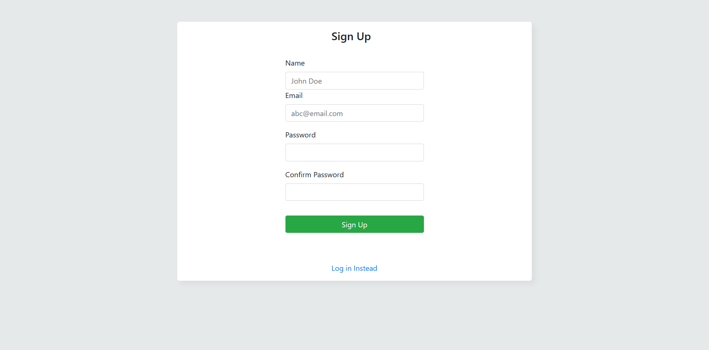

# NodeJS-Placement-Cell
 <h1 align="center">Placement Cell  📝</h1> 

 <p >
 
 
 An interface for coding ninjas placement cell to keep records of students and schedule interviews with different companies <br>
     This App built using <a href="https://ejs.co/">EJS</a>, <a href="https://www.mongodb.com/">MongoDB</a>, <a href="https://expressjs.com/">ExpressJs</a>, <a href="https://nodejs.org/en/">NodeJs</a> and <a href="http://www.passportjs.org/">PassportJS</a>
</p>

## Features

- Sign up / Sign in forms for employees
- Add a new student to the list of students
- Allocate and schedule interview with different companies and update their result status
- Download reports of students in csv format

  ## Folder Structure
```
Placement-Cell/
|── |assets/
│   |      ├── css/
│   │      |     ├── styles.css
│   |      ├── js/
│   |            ├── script.js
│   ├── uploads/
│   ├── index.html
|   |
├── routes/
│   ├── companyRoute.js
│   ├── userRoute.js
│   ├── studentRoute.js
│   ├── index.js
|   |
├── controllers/
│   ├── companyController.js
│   ├── homeController.js
│   ├── studentController.js
│   ├── userController.js
|   |
├── models/
│   ├── companySchema.js
│   ├── userSchema.js
│   ├── studentSchema.js
|   |
├── views/
│   ├── sinup.ejs
│   ├── signin.ejs
│   ├── home.ejs
│   ├── company.ejs
│   ├── allocationinterview.ejs
│   ├── add_student.ejs
├── .gitignore
├── package.json
├── README.md
```

  ## Screenshots

- Sign Up
  

- Sign In
  

- Student Page
  

- Interview Page
  

- Add student
  

- Schedule Interview
  

## Setup

Run `npm install` to install required dependencies

Environment Variables:

- PORT = [Your Port]
- SECRET = [Your Secret]
- MONGO_URI = [Your MongoDB Ur]
#
